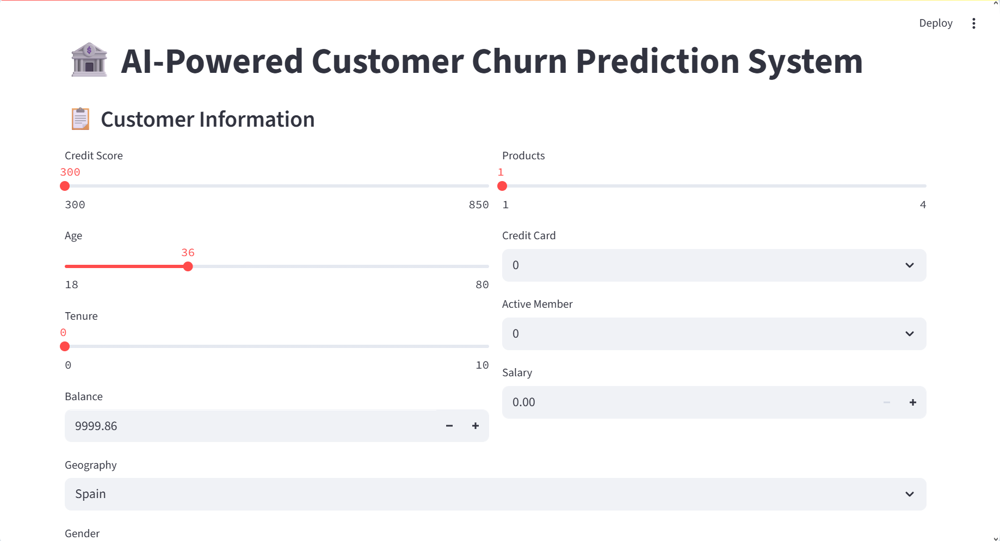
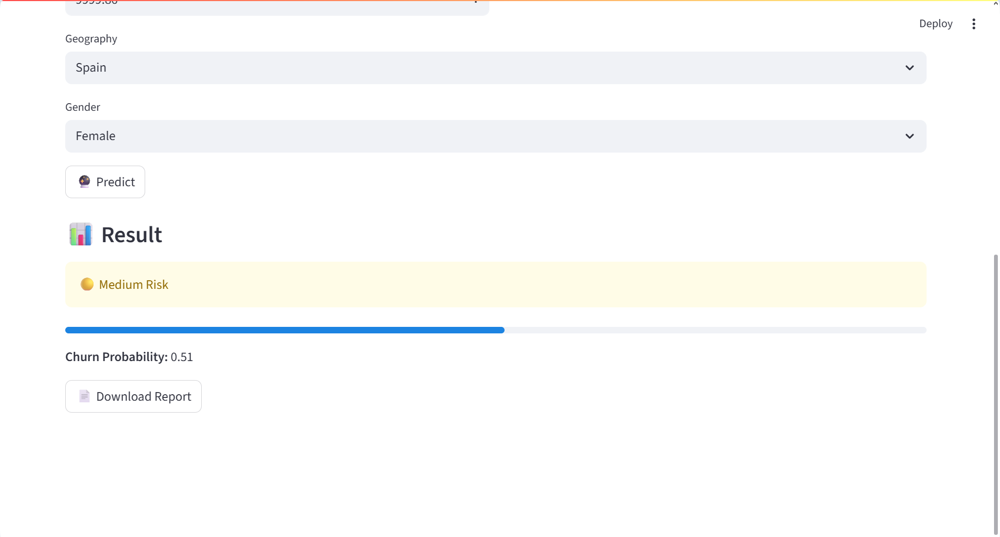

## 🚀 Bank Customer Churn Prediction System
🌐 **Live Dashboard:** https://bank-customer-churn-prediction-ewbgdvurbyq6rwcgratzds.streamlit.app/ 


An AI-powered machine learning web application that predicts whether a bank customer is likely to churn using customer demographics, banking activity, and behavioral data.

Built with:
- Python
- Streamlit
- Scikit-learn
- Machine Learning
- Data Analytics

---

# 📌 Project Overview

Customer churn is one of the biggest challenges in the banking sector. Retaining customers is significantly cheaper than acquiring new ones.

This project uses Machine Learning algorithms to analyze customer information and predict churn probability in real time through an interactive Streamlit dashboard.

The system helps banks:
- Identify high-risk customers
- Improve retention strategies
- Reduce revenue loss
- Make data-driven decisions

---

# ✨ Features

✅ AI-powered churn prediction  
✅ Real-time probability score  
✅ Interactive Streamlit UI  
✅ Customer risk categorization  
✅ Downloadable prediction report  
✅ Data preprocessing pipeline  
✅ Feature scaling integration  
✅ Machine learning deployment ready  
✅ Responsive dashboard design  

---

# 🧠 Machine Learning Workflow

The project follows a complete end-to-end ML pipeline:

1. Data Collection
2. Data Cleaning
3. Exploratory Data Analysis (EDA)
4. Feature Engineering
5. Data Preprocessing
6. Model Training
7. Model Evaluation
8. Deployment with Streamlit

---

# 📊 Input Features

| Feature | Description |
|---|---|
| CreditScore | Customer credit score |
| Age | Customer age |
| Tenure | Years with bank |
| Balance | Account balance |
| NumOfProducts | Number of bank products |
| HasCrCard | Credit card ownership |
| IsActiveMember | Active membership status |
| EstimatedSalary | Estimated yearly salary |
| Geography | Customer country |
| Gender | Customer gender |

---

# 🤖 Machine Learning Model

The churn prediction model was trained using:

- Logistic Regression
- Random Forest Classifier
- Scikit-learn preprocessing pipeline

Additional techniques:
- Feature Scaling
- One-Hot Encoding
- Train-Test Split
- Model Evaluation Metrics

---

# 📈 Output

The system predicts:

- Churn Probability
- Risk Level:
  - 🟢 Low Risk
  - 🟡 Medium Risk
  - 🔴 High Risk

---

# 🛠️ Tech Stack

| Technology | Usage |
|---|---|
| Python | Programming Language |
| Pandas | Data Processing |
| NumPy | Numerical Operations |
| Scikit-learn | Machine Learning |
| Streamlit | Web App Framework |
| Joblib | Model Serialization |

---

# 📂 Project Structure

```bash
bank-customer-churn-prediction/
│
├── app.py
├── requirements.txt
├── README.md
│
├── model/
│   ├── churn_model.pkl
│   └── scaler.pkl
│
├── utils/
│   ├── __init__.py
│   └── helper.py
│
└── dataset/
    └── churn.csv
```

---

---

# 📸 Application Preview


 
## Dashboard Features
- Customer Information Form
- AI Prediction Engine
- Risk Probability Visualization
- Downloadable Reports

---

# 🔥 Future Improvements

- Deep Learning Integration
- XGBoost Model
- Customer Segmentation
- Power BI Dashboard Integration
- Cloud Deployment
- Real-time Database Integration
- Explainable AI (SHAP)

---

# 🌐 Deployment

The project can be deployed using:

- Streamlit Cloud
- Render
- Railway
- Hugging Face Spaces

---

# 📚 Learning Outcomes

Through this project, you will learn:

- Machine Learning Deployment
- Feature Engineering
- Streamlit Development
- Data Preprocessing
- Model Serialization
- Real-world Banking Analytics

---

# 👨‍💻 Author

## Tejas Hagawane

- Data Analytics Enthusiast
- Machine Learning Developer
- Python Developer

GitHub: https://github.com/tejashagawane

LinkedIn: https://www.linkedin.com/in/tejas-hagawane/

---

# ⭐ If You Like This Project

Give this repository a ⭐ on GitHub and support the project.

---

# 💡 Keywords

Machine Learning, Customer Churn Prediction, Streamlit App, Banking Analytics, AI Dashboard, Python Project, Data Science, Scikit-learn, Bank Analytics, Predictive Analytics
